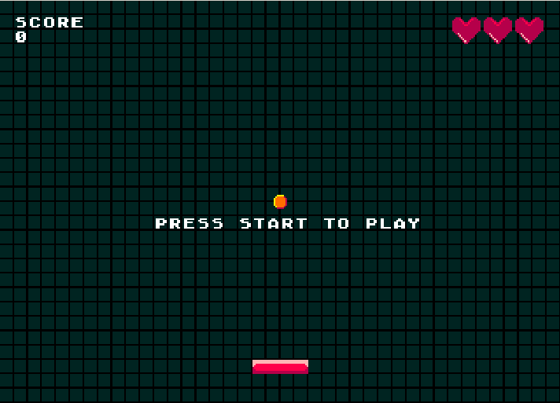

# Megadrive Pong Game

### Introduction

This is a very simple pong game made by following these [SGDK tutorials](http://www.ohsat.com/tutorial/megapong/megapong-1/).
Since the tutorial series was not finalized there are few extras made by me (like limited lives). This project is meant to be used as a starting point for everyone wishing to learn Megadrive game development using SGDK.



### Installation

I used a linux based enviroment and Gendev for compiling the project. The SGDK provides a makefile for you so the command that should be run from the main directory should look something like the following line where $GENDEV is the install directory (usually /opt/gendev). For a more automated process you can use visual studio code.
```
make $GENDEV/sgdk/mkfiles/makefile.gen
```

For emulation I used Gens KMod because of it's great debug capabilities and it works well under wine.
